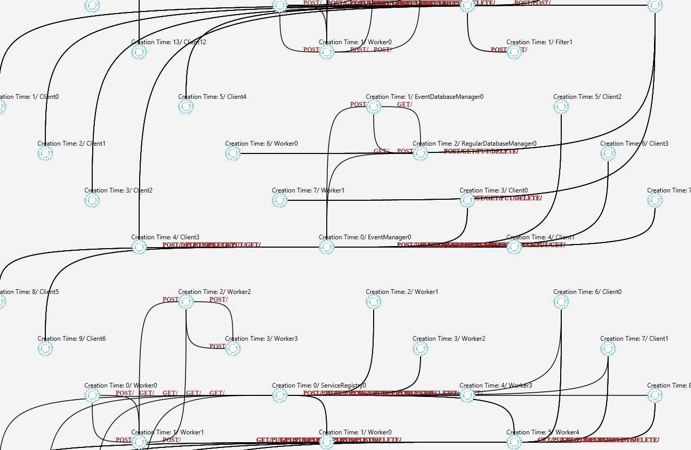

# BenchPDM

[]
[]
[]
[]
dependencyGraph

**BenchPDM : Benchmarking Pattern Detection Methods 
in Microservice-Based Systems Using Automatically Generated Pattern-Assisted Testbeds**

You can find the detailed analysis in the following Jupyter Notebook: [PatternFormalDescription.ipynb](./_notebooks/PatternFormalDescriptiontebooks/PatternFormalDescription.ipynb)
