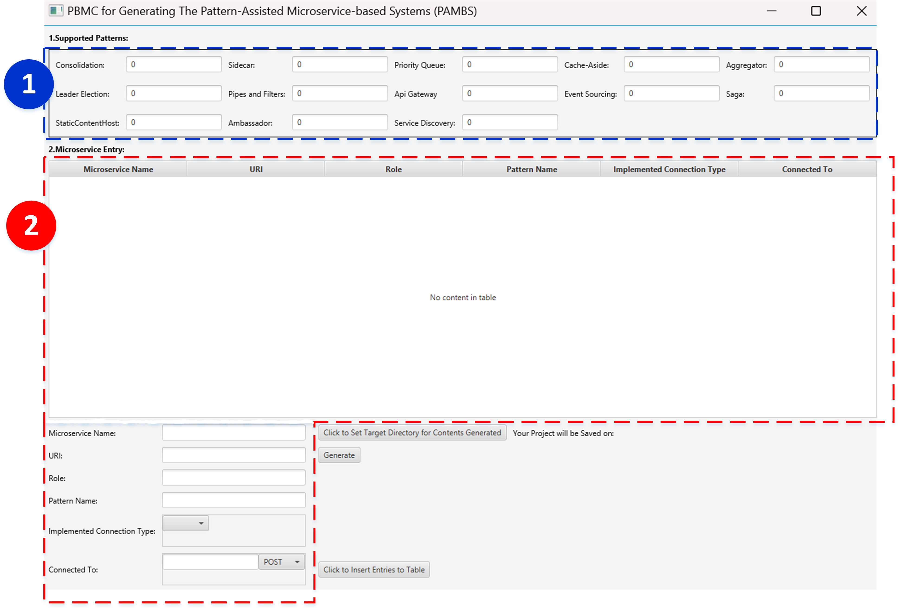
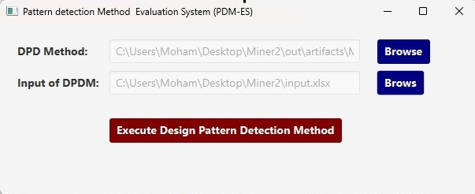

# BenchPDM

<div align="center">


**BenchPDM : Benchmarking Pattern Detection Methods 
in Microservice-Based Systems Using Automatically Generated Pattern-Assisted Testbeds**
</div>

## Table of Contents
- [Application of BenchPDM](#Application-of-BenchPDM)
   - [PBMC Module](#PBMC-Module)
   - [PDM-ES Module](#PDM-ES-Module)
- [Installation of the PDM-ES Module](#Installation-of-the-PBMC-Module)
- [Steps for Implementing PBMC](#Steps-for-Implementing-PBMC)
- [Installation of the PDM-ES Module](#Installation-of-the-PDM-ES-Module)
- [Steps for Implementing PDM-ES](#Steps-for-Implementing-PDM-ES)
- [Formal Description of Microservice Patterns within BenchPDM](#Formal-Description-of-Microservice-Patterns-within-BenchPDM)
- [Sample Microservice Patterns Generated by BenchPDM](#Sample-Microservice-Patterns-Generated-by-BenchPDM)

## Application of BenchPDM
  **BenchPDM**  is a benchmark for pattern-assisted microservice-based system (PAMBS) consisting of two important modules **PBMC** and **PDM-ES**.
  To support Pattern Detection Methods (PDM) that accommodate programming languages other than Java, the benchmark provides output in three types, generated code of a PAMBS, dependency graph for the pattern-assisted microservice-based system  
  (PAMBS) in an XML format, and tracing information of the MS within the 
  system and storing them using the **Zipkin format**.
  
  ### PBMC Module
  
  Pattern-based microservice systems creator **(PBMC)** module, is capable of generating microservice-based systems that communicate with each other through various microservice patterns, each serving a different purpose.


  ### PDM-ES Module
  
  The PDM Evaluation System **(PDM-ES)** module, is responsible for evaluating pattern detection methods based on common evaluation metrics in the field of design pattern detection. This part allows for the evaluation and comparison of different PDMs at different levels of complexity.
  

## Installation of the PBMC Module
+  You need to specify the JavaFX module path when running the application on your local system. Use the following command:

  ```bash
    java --module-path /path/to/javafx-sdk/lib --add-modules javafx.controls,javafx.fxml -jar PBMC.jar
  ```
+ You can download the JavaFX SDK from [here](https://gluonhq.com/products/javafx/)
+ Ensure you replace `/path/to/javafx-sdk/lib` with the correct path to the JavaFX SDK on your machine.

## Steps for Implementing PBMC

+ After executing the above command, the PBMC module will be displayed as follows.


<p align="center">

</p>

+ 1- If the pattern detection method is capable of identifying any of the thirteen predefined patterns within BenchPDM, you can select any of these patterns from Section 1, in any quantity, for inclusion in PAMBS.
  
+ 2- If the pattern detection method is to be evaluated using new patterns beyond the predefined list in Section 1, a new pattern can be defined through Section 2. Each row in the table of Section 2 specifies the details of each microservice within the new pattern.
  
  - Through the **Click to Set Target Directory for Contents Generated** button, you need to select a directory to save the generated PAMBS.

  - By pressing the **Generate** button, based on the configured settings, the desired patterns will be created within the PAMBS and saved in the selected folder.
 
+ First case: For example, the figure below illustrates a scenario where the PAMBS system contains 15 instances of 6 predefined patterns from BenchPDM.

<p align="center">

</p>


+ Second case: The image below shows that the user has defined a new pattern by entering the details of the microservices within it.

<p align="center">

</p>


+ Figure below illustrates an example output generated by BenchPDM, formatted in Zipkin style.

<p align="center">

</p>

+ A part of the generated service dependency graph is shown below.

<p align="center">

</p>

## Installation of the PDM-ES Module

+  You need to specify the JavaFX module path when running the application on your local system. Use the following command:

  ```bash
    java --module-path /path/to/javafx-sdk/lib --add-modules javafx.controls,javafx.fxml -jar PDM-ES.jar
  ```
+ You can download the JavaFX SDK from [here](https://gluonhq.com/products/javafx/)
+ Ensure you replace `/path/to/javafx-sdk/lib` with the correct path to the JavaFX SDK on your machine.

## Steps for Implementing PDM-ES

+ After executing the above command, the PDM-ES module will be displayed as follows.


<p align="center">

</p>

   - In the TextField for the **DPD Method**, the address of the pattern recognition method code to be evaluated by the PDM-ES module must be entered.

   - In the TextField for the **Input of DPDM**, one of the three outputs generated by BenchPDM, including the PAMBS source code, the service dependency graph in XML format, or the saved trace file, should be provided.

## Formal Description of Microservice Patterns within BenchPDM


+ Users can select from a predefined set of 13 microservice design patterns defined within
  the BenchPDM. A comprehensive description of the behaviors of the 13 patterns can be seen in the [Pattern_Description] (./Pattern_Description/MSdesignpatterns.pdf) folder.


## Contact Information

<p align="center">
  <a href="mailto:nmohammadi.um@gmail.com">
    
  </a>
  &nbsp;&nbsp;&nbsp;&nbsp;
  <a href="https://www.linkedin.com/in/neda-mohammadi-9486971a1/">
    
  </a>
  &nbsp;&nbsp;&nbsp;&nbsp;
  <a href="https://www.orcid.org/my-orcid?orcid=0000-0002-4949-3390">
    
  </a>
</p>


